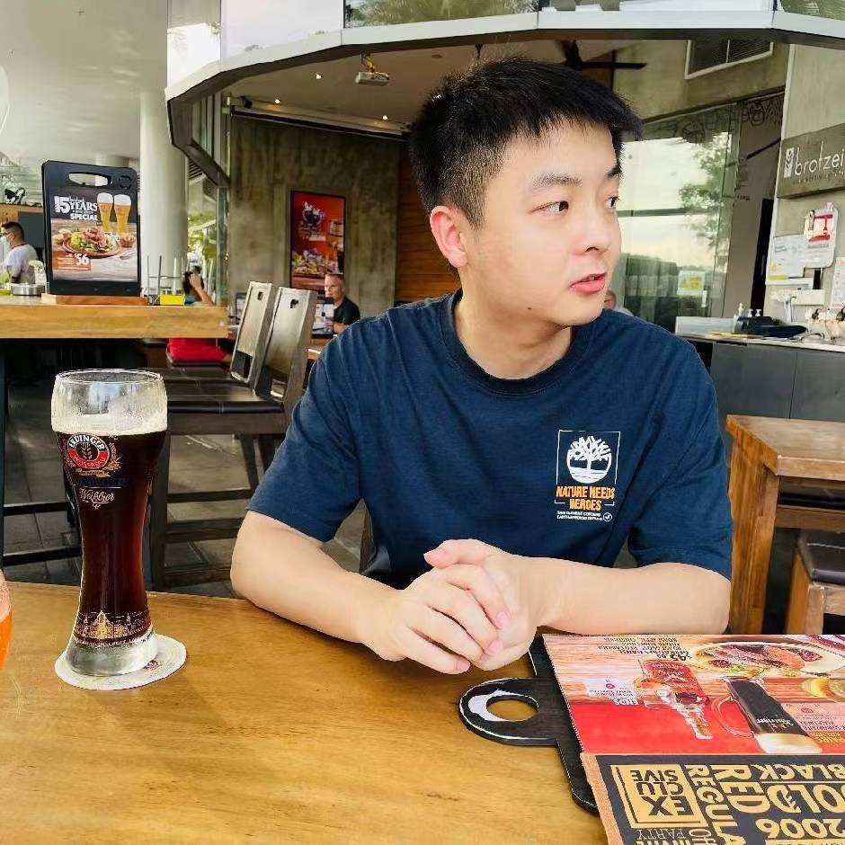

## About Me

Hi! I received my BEng degree from Jilin University, China. Then, I received the MSc and Ph.D. degree from  Nanyang Technological University, Singapore. I am an Associate Editor at Computers and Electrical Engineering. I am the guest editor of Information Fusion, Engineering Applications of Artificial Intelligence, and Frontiers in Marine Science. I am the chair of an invited session at ICONIP 2023/2024.

My Ph.D. was co-supervised by [Prof. Suganthan](https://scholar.google.com/citations?user=yZNzBU0AAAAJ&hl=zh-CN) (IEEE Fellow), [Asst Prof. Yuen Kum Fai](https://dr.ntu.edu.sg/cris/rp/rp00720), and [Dr. Okan Duru](https://scholar.google.se/citations?user=JT_KdJgAAAAJ&hl=en). You can find the full publication list at my [Google Scholar](https://scholar.google.se/citations?user=PrIHu7QAAAAJ&hl=en&oi=ao).

## Academic Service
Associate editor at [Computers & Electrical Engineering](https://www.sciencedirect.com/journal/computers-and-electrical-engineering)

Guest editor at [Information Fusion](https://www.sciencedirect.com/journal/information-fusion), Topic: Multi-source data fusion for sustainable cities

Guest editor at [EAAI](https://www.sciencedirect.com/journal/engineering-applications-of-artificial-intelligence), Topic: Advanced machine learning for the maritime industry

Guest editor at [Computers & Electrical Engineering](https://www.sciencedirect.com/journal/computers-and-electrical-engineering), Topic: Randomization-Based Deep and Shallow Learning Algorithms

Guest editor at [Frontiers in Marine Science](https://www.frontiersin.org/research-topics/65506/emerging-computational-intelligence-techniques-to-address-challenges-in-oceanic-computing), Topic: Emerging Computational Intelligence Techniques to Address Challenges in Oceanic Computing

Session chair at ICONIP 2023/2024.

Reviewers for IEEE TNNLS, T-SMC-Systems, TVT, TFS; Elsevier PRJ, ASOC, EAAI, CAEE, APEN; Springer NCAA; PVLDB, CIKM

## Research Interest

My research interests include machine learning, randomized neural networks, time series forecasting, and artificial intelligence for the maritime industry.

## Selected Publications

Gao, R., Li, R., Hu, M., Suganthan, P. N., & Yuen, K. F. (2023). Dynamic ensemble deep echo state network for significant wave height forecasting. Applied Energy, 329, 120261.

Du, L., Gao, R., Suganthan, P. N., & Wang, D. Z. (2022). Bayesian optimization based dynamic ensemble for time series forecasting. Information Sciences, 591, 155-175.

Snasel, V., Štěpnička, M., Ojha, V., Suganthan, P. N., Gao, R., & Kong, L. (2024). Large-scale data classification based on the integrated fusion of fuzzy learning and graph neural network. Information Fusion, 102, 102067.

Wu, Y., Fan, M., Cao, Z., Gao, R., Hou, Y., & Sartoretti, G. (2023, December). Collaborative Deep Reinforcement Learning for Solving Multi-Objective Vehicle Routing Problems. In 23rd International Conference on Autonomous Agents and Multi-Agent Systems (AAMAS).

Gao, R., Li, R., Hu, M., Suganthan, P. N., & Yuen, K. F. (2023). Online dynamic ensemble deep random vector functional link neural network for forecasting. Neural Networks, 166, 51-69.

Liang, M., Weng, L., Gao, R., Li, Y., & Du, L. (2024). Unsupervised maritime anomaly detection for intelligent situational awareness using AIS data. Knowledge-Based Systems, 284, 111313.

> To a great mind, nothing is little
